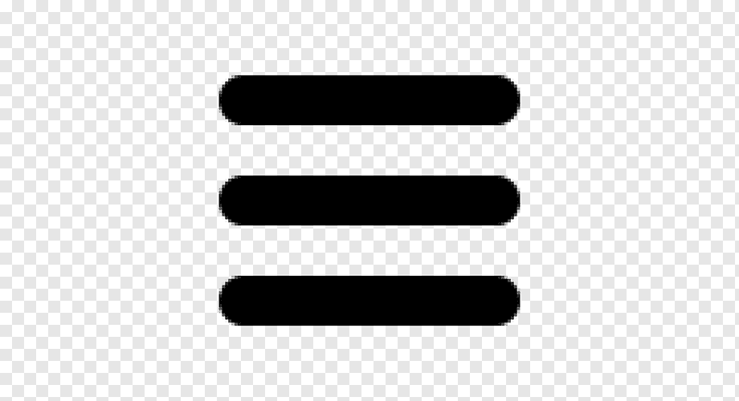
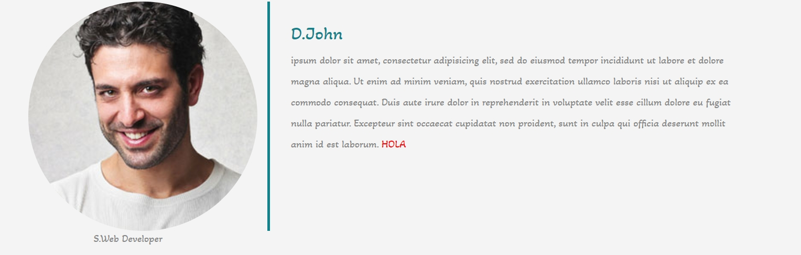
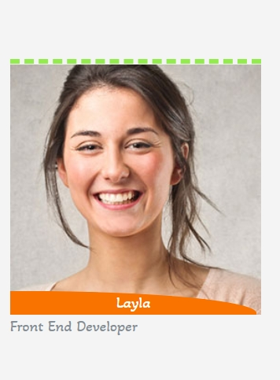
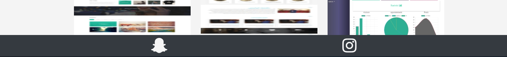

# EXAMEN DE: `Desarrollo de páginas web estáticas (HTML y CSS)`

Empleo Nombre y apellidos:

Fecha y hora:

<hr>

## Normas Generales para la Prueba

1. Haga un `fork` del repositorio de https://git.institutomilitar.com/ le indique el profesor y cambie la visibilidad a privado
1. Clone el repositorio en local para que pueda trabajar en su equipo.
1. Modifique el `README.md`, debe poner su **nombre y apellidos** y el siguiente texto:  
   `EXAMEN DE Desarrollo de páginas web estáticas (HTML y CSS) DIM XXXXXXXX`
1. Antes de continuar con el examen realice un `commit` con el texto: `Modificado README`, y súbalo al repositorio del apartado 1 de estas Normas generales.
1. A lo largo de todo el examen no se pueden utilizar estilos en línea, no se tendrán en cuenta y restará en el apartado de `guía de estilo`.
1. Todo el `CSS` debe estar en un archivo aparte.
1. (2 puntos) En la línea donde responda, bien sea en el `html` o en el `css`, debe abrir un comentario con el texto:  
   **RESPUESTA A NÚMERO _número dela pregunta_**  
    ejemplo `css`:

   ```css
   /*  RESPUESTA A NUMERO 2.4 */
   p {
     color: red;
   }
   ```

   ejemplo `html`:

   ```html
   <!-- RESPUESTA A NUMERO 2.4  -->
   <div class="ejemplo">
     <p>Lorem ipsum dolor sit amet consectetur adipisicing elit.</p>
   </div>
   ```

1. El examen consta de 49 puntos a completar más 5 puntos de guía de estilo.
1. El 5, que es el aprobado, se obtiene alcanzando 27 puntos.
1. El tiempo para realizar el examen es de 100 minutos, antes de finalizar ese tiempo deberá hacer un commit con su solución con el texto `Fin Examen`, no se tendrá en cuenta ningún commit posterior.
1. El inicio del examen se pondrá en el canal de la asignatura HTML

# PREGUNTAS

1.  (2 puntos) La página debe tener una descripción y autor.
1.  (1 puntos) El navegador debe saber la información sobre con que gestor de contenidos o que otros métodos hemos generado la página web.  
1.  (1 punto) El navegador debe reducir para ajustarse al contenido que desborda los limites de las vistas.
1.  Dados los archivos locales adjuntos, víncule de forma local y en el orden apropiado los siguientes elementos:

    1. (1 punto) Hoja de estilos de `bootstrap` y `main.css`
    1. (1 punto) JavaScript necesario para `bootstrap`

1.  (4 puntos) Ponga la imagen `perfil.jpg`, que se encuentra en `examen-desarrollo-de-paginas-web-estaticas/images/favicon`, como `favicon` del documento html `index.html` que se encuentra en la raiz del proyecto.

1.  (2 puntos) Sustituya la palabra `Home` que hay en el `navbar` por el icono de fontawesome de desee de la version 5 o superior.
1.  Haga los cambios necesarios, donde crea oportuno, para que:
    1. (1 punto) La barra de navegación no este pegada a la parte superior de la pantalla
    1. (1 punto) La barra de navegación se vea de color negro
    1. (1 punto) En la barra de navegación, el icono de "hamburguesa" aparezca al ir reduciendo el tamaño de la pantalla.  
         
    1. (1 punto) el **único** efecto que debe aparecer al pasar el ratón por encima del texto debe ser que se ponga de color naranja (`#f97300`)
       _Recuerde que no están permitidos los estilos en línea_
1.  (1 punto) El icono del anterior apartado debe dirigirnos en una pestaña nueva a `https://git.institutomilitar.com/`
1.  (1 punto) El texto que estas dentro de la etiquetas `<p> </p>` del `header` debe estar alineado a la derecha
1.  (1 punto) Cree un archivo `css` de nombre `nombreAlumno.css`  , y vincúlelo a `index.html`.
1.  (1 punto) En el archivo del apartado anterior, importe la letra de Google Fonts `Akaya Telivigala` con los estilos que que vd quiera.
1.  (1 punto) en el archivo `nombreAlumno.css` declare una variable llamada `akaya` y que cuando se haga referencia a ella se muestre la fuente `Akaya Telivigala`.
1.  (2 puntos) Sin hacer ninguna modificación en `main.css` cambie el tipo de letra a `Akaya Telivigala` de toda la web.
1.  (1 punto) Use la variable `akaya` para realizar  el apartado anterior.
1.  En el apartado `About Me`, al final del párrafo debe aparecer el texto `HOLA` (2 puntos) en color **rojo** (1 punto), este texto no se podrá seleccionar con el ratón. No puede hacer ninguna modificación en `index.html`.
    
1.  (1 punto) El `footer` de la primera `card` (la que esté más a la izquierda) debe tener un `padding-top` de `5em`. _No está permitido usar id_
1.  (1 punto) En el apartado `Blog`, en el texto ( `proident, sunt in culpa qui officia deserunt mollit anim id est laborum.` ) de la `card` de más a la derecha, debe aparecer en tres linea dentro del mismo párrafo.
1.  (5 puntos) Al pulsar la imagen de `Chris` debe aparecer un modal.
1.  (1 puntos) Cuando aparezca el modal debe mostrar una imagen de su elección de forma correcta.
1.  (1 punto) Declare una variable llamada `miColor` que apunte al color ` rgb(148, 235, 78)`
1.  Sin hacer ningún cambio en `index.html` y usando `nombreAlumno.css`  la imagen de Layla (1 punto) tendrá un borde solo por su lado superior de 5px de grosor(1 punto), discontinuo (1 punto) y de color de su variable (1 punto). _debe usar la variable y no el valor al que apunta_
    - Imagen Layla  
      
1.  (1 punto) Cuando se rellene el formulario nos debe avisar si no se ha introducido un mail.
1.  (2 puntos) En el formulario debe permitir introducir el télefono . _Solo debe permitir introduccir teléfonos_
1.  En el `footer`:
    1. (1 punto) Cada icono debe estar distribuidos en el ancho de la página como se muestra en la imagen.
       
    1. (1 punto) Los iconos deben ser de color blanco.
    1. (2 puntos) Los iconos de las RRSS al pasar el ratón por encima de ellos deben cambiar al color de su variable. Es obligatorio usar la variable y no el valor al que apunta.
    1. (1 punto) Al hacer `click` sobre el icono de instagram debe dirigirte a la página https://www.instagram.com/ sin abrir una nueva pestaña.
    1. (1 punto) El footer debe estar siempre visible, es decir, no se debe hacer scroll ni cambiar el zoom de la página para que se pueda ver.
