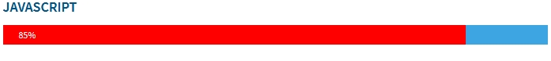

# EXAMEN DE: `Desarrollo de páginas web estáticas (HTML y CSS)`

Empleo Nombre y apellidos:

Fecha y hora:

<hr>

## Normas Generales para la Prueba

1. Inicie una grabación de sus pantallas con la aplicación `OBS`, recuerde que el formato de salida de la grabación debe ser `mkv`. La grabación debe guardarse en el disco duro. En su grabación debe verse tanto el inicio del examen (se iniciará por mensaje en el chat de la comunidad, canal html) como el fin (realizar commit final y comprobar que está).
1. Cree un repositorio **privado** en https://git.institutomilitar.com/ con el nombre :  
   `examen-html-DIM43-empleo.apellidoCaracterístico`
1. (`0.5 puntos`) En el `README.md` debe poner su nombre y apellidos y el siguiente texto:  
   `EXAMEN DE Desarrollo de páginas web estáticas (HTML y CSS) DIM XLIII`
1. El proyecto base del examen es el ejercicio de `PortaFolio` desarrollado en clase puede utilizar el suyo o la solución del profesor, disponible en la carpeta de red:  
   `172.16.250.202/fase-presente/16.HTML-CSS/portaFolioSolucion`.
   1. (`0.5 puntos`) Suba una de las dos opciones al repositorio que ha creado en el apartado 2 de las `NORMAS GENERALES PARA LA PRUEBA` con un commit de texto de mensaje `Repositorio base`
1. Antes de continuar con el examen realice el apartado 4.1
1. A lo largo de todo el examen no se pueden utilizar estilos en línea, no se tendrán en cuenta y restará en el concepto de `guia de estilo`.
1. Todo el `CSS` que implenete debe estar en un archivo aparte.

<br>
1. En la línea donde responda, bien sea en el `html` o en el `css`, debe abrir un comentario con el texto:  
   **--- RESPUESTA A NÚMERO _número dela pregunta_ ---**  
    ejemplo `css`:

```css
/* --- RESPUESTA A NUMERO 2.4 ---*/
p {
  color: red;
}
```

ejemplo `html`:

```html
<!-- --- RESPUESTA A NUMERO 2.4 --- -->
<div class="ejemplo">
  <p>Lorem ipsum dolor sit amet consectetur adipisicing elit.</p>
</div>
```

<div style="page-break-after: always;"></div>

1.  **DOCUMENTO**
    1. (`4 puntos`) A excepción de lo necesario para `fontawesome` y Google Fonts la página `PortaFolio` debe poder verse correctamente sin tener acceso a internet.
    1. (`4 puntos`) Importe utilice la Fuente de Google Fonts `Source Sans Pro` con un grosor de letra de `300`, `400`, `600`, `900`
    1. En su archivo `css` declare las variables:
       1. (`2 puntos`) `color` y asigne el color `#3da5e2`
       1. (`2 puntos`) `letra` y asigne el valor de la `font-family` que ha importado en le apartado anterior.
1.  **HEADER**
    1. (`2 puntos`) Implemente lo necesario para que el icono del sobre sea del color de su variable. No puede usar usar selectores tipo `clase` ni tipo `id`.
1.  **IMAGENES**

    1. (`4 puntos`) Implemente lo necesario para que al pulsar la imagen de la derecha de la segunda línea habra un modal **SOLO** con la misma imagen sin ningún tipo de margen.
    1. (`2 puntos`) El modal debe aparecer en el centro de la pantalla
    1. (`4 puntos`) Implemente lo necesario para que en dispositivos con una resolución de pantalla menor a `971px*600px` el orden de las imagenes cambie según la siguiente tabla:
       | Número Imagen| pantalla < `971px*600px` | pantalla > `971px*600px`|
       |--|--|--|
       |&nbsp;&nbsp;&nbsp;&nbsp;&nbsp;&nbsp;&nbsp;&nbsp;&nbsp; 1|&nbsp;&nbsp;&nbsp;&nbsp;&nbsp;&nbsp;&nbsp;&nbsp;&nbsp;&nbsp;&nbsp;&nbsp;&nbsp;&nbsp; 7 | &nbsp;&nbsp;&nbsp;&nbsp;&nbsp;&nbsp;&nbsp;&nbsp;&nbsp;&nbsp;&nbsp;&nbsp;&nbsp;&nbsp;&nbsp;1 |
       |&nbsp;&nbsp;&nbsp;&nbsp;&nbsp;&nbsp;&nbsp;&nbsp;&nbsp; 2|&nbsp;&nbsp;&nbsp;&nbsp;&nbsp;&nbsp;&nbsp;&nbsp;&nbsp;&nbsp;&nbsp;&nbsp;&nbsp;&nbsp; 3 | &nbsp;&nbsp;&nbsp;&nbsp;&nbsp;&nbsp;&nbsp;&nbsp;&nbsp;&nbsp;&nbsp;&nbsp;&nbsp;&nbsp;&nbsp;2 |
       |&nbsp;&nbsp;&nbsp;&nbsp;&nbsp;&nbsp;&nbsp;&nbsp;&nbsp; 3|&nbsp;&nbsp;&nbsp;&nbsp;&nbsp;&nbsp;&nbsp;&nbsp;&nbsp;&nbsp;&nbsp;&nbsp;&nbsp;&nbsp; 4 | &nbsp;&nbsp;&nbsp;&nbsp;&nbsp;&nbsp;&nbsp;&nbsp;&nbsp;&nbsp;&nbsp;&nbsp;&nbsp;&nbsp;&nbsp;3 |
       |&nbsp;&nbsp;&nbsp;&nbsp;&nbsp;&nbsp;&nbsp;&nbsp;&nbsp; 4|&nbsp;&nbsp;&nbsp;&nbsp;&nbsp;&nbsp;&nbsp;&nbsp;&nbsp;&nbsp;&nbsp;&nbsp;&nbsp;&nbsp; 5 | &nbsp;&nbsp;&nbsp;&nbsp;&nbsp;&nbsp;&nbsp;&nbsp;&nbsp;&nbsp;&nbsp;&nbsp;&nbsp;&nbsp;&nbsp;4 |
       |&nbsp;&nbsp;&nbsp;&nbsp;&nbsp;&nbsp;&nbsp;&nbsp;&nbsp; 5|&nbsp;&nbsp;&nbsp;&nbsp;&nbsp;&nbsp;&nbsp;&nbsp;&nbsp;&nbsp;&nbsp;&nbsp;&nbsp;&nbsp; 6 | &nbsp;&nbsp;&nbsp;&nbsp;&nbsp;&nbsp;&nbsp;&nbsp;&nbsp;&nbsp;&nbsp;&nbsp;&nbsp;&nbsp;&nbsp;5 |
       |&nbsp;&nbsp;&nbsp;&nbsp;&nbsp;&nbsp;&nbsp;&nbsp;&nbsp; 6|&nbsp;&nbsp;&nbsp;&nbsp;&nbsp;&nbsp;&nbsp;&nbsp;&nbsp;&nbsp;&nbsp;&nbsp;&nbsp;&nbsp; 1 | &nbsp;&nbsp;&nbsp;&nbsp;&nbsp;&nbsp;&nbsp;&nbsp;&nbsp;&nbsp;&nbsp;&nbsp;&nbsp;&nbsp;&nbsp;6 |
       |&nbsp;&nbsp;&nbsp;&nbsp;&nbsp;&nbsp;&nbsp;&nbsp;&nbsp; 7|&nbsp;&nbsp;&nbsp;&nbsp;&nbsp;&nbsp;&nbsp;&nbsp;&nbsp;&nbsp;&nbsp;&nbsp;&nbsp;&nbsp; 2 | &nbsp;&nbsp;&nbsp;&nbsp;&nbsp;&nbsp;&nbsp;&nbsp;&nbsp;&nbsp;&nbsp;&nbsp;&nbsp;&nbsp;&nbsp;7 |

       <div style="page-break-after: always;"></div>

1.  **ACERCA DE**

    1. La imagen debe:
       1. (`6 puntos`) Ser redondeada con un borde de puntos de 5px de grosor y el color de su varible (debe hacer uso de la variable y no del valor al que apunta), sirva como modelo el siguiente ejemplo:  
          
       1. (`2 puntos`) Solo en dispositivos con pantalla superiores a `1200px` la imagen debe aparecer a la izquierda, en el resto de dispositivos debe aparecer encima del texto `Acerca de`
    1. El Texto de la imagen del perfil debe:
       1. (`1 punto`) Ser del color de la variable que declaró (use la variable para que sea correcto)
       1. (`1 punto`) La fuente de la letra debe ser el de la variable que anteriormente declaró
       1. (`1 punto`) El grueso de la letra debe ser de `300`;
       1. (`1 punto`) El tamaño de la letra debe ser de `18px`;
       1. (`1 punto`) Debe haber espaciado entre letras de `2px`;
    1. En las barras de progreso:
       1. (`1 punto`) El fondo de la barra de progreso debe ser de color de la variable que declaró
       1. (`1 punto`) Que la barra de progreso sea sin bordes redondeados
       1. (`1 punto`) El Alto sea de `25px`;
       1. (`1 punto`) Que cada tenga un margen inferior exterior de `15px`;
       1. (`1 punto`) el color de la barra de progreso será `rgb(255,0,0)`
       1. (`1 punto`) El texto deberá estar centrado en vertical en la barra.
       1. (`1 punto`) El Texto que hay dentro de la barra de progreso debe estar alineado como en el siguiente ejemplo:  
          
          <div style="page-break-after: always;"></div>

1.  **CONTACTO**
    1. (`1 punto`) Los campos Mail debe ser obligatorios
    1. (`1 punto`) El campo nombre tiene que tener 3 caracteres como mínimo
    1. (`1 punto`) El Botón de enviar debe ser sin relleno y de color verde y cuando se pase el ratón por encima se debe rellenar de color verde y el texto en blanco.
    1. (`1 punto`) Debe cambiar el Color del `placeholder` del `textarea` al color de su variable.
    1. (`1 punto`) Al pulsar el botón debe borrarse el formulario
1.  **Realice un separador con las siguientes características:**
    1. (`1 punto`) Grosor de `1px`
    1. (`1 punto`) Debe ser un trazo de puntos
    1. (`1 punto`) El color debe ser el de su variable de color.
    1. (`1 punto`) Debe ocupar `3/4 partes` de la pantalla
1.  **FOOTER**
    1. (`4 puntos`) Ponga un `tooltip` que se muestre hacia arriba al icono de `gitLab` que ponga `InstitutoMilitar`
    1. (`8 puntos`) Ponga el siguiente icono de fontAwesome `<i class="fa fa-file" aria-hidden="true"></i>` entre los que ya hay en el `footer` y que cuando se haga click le direccione en otra pestaña a la página de `https://web.institutomilitar.com/` pero está debe tener un acceso local (quiere decir que se pueda acceder a ella sin que haya conexion a internet).
    1. (`2 puntos`) El icono debe estar en concordancia (alineamiento y dimensiones) con los que había en el `footer` _No es necesario que le cambie de color ni le ponga efecto hover_
