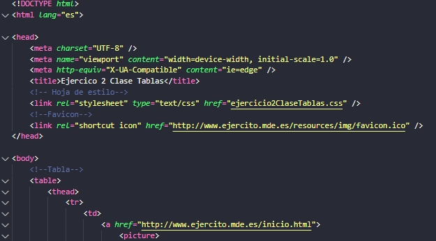
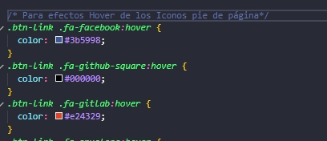
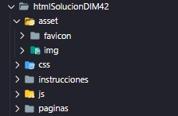

# PRÁCTICA FINAL ASIGNATURA HTML Y CSS

## NORMAS GENERALES
 - Solo se valorará lo solicitado.
 - Se debe subir el proyecto a [gitLab](https://git.institutomilitar.com/) del Dpto. Informática y Ciberdefensa.
 - El proyecto debe ser privado y se invitará al Profesor de la asignatura a él. 
 - El nombre será HTML_nombreALumno_DIM42
 - La claridad y la buena indentación será fundamental
 - Se aconseja usar etiquetas semánticas
 - Aunque se puede realizar en HTML 5 puro se aconseja usar bootstrap.
 - Debe ser responsive.
 - Se comentará cada funcionalidad que se haga, sirva como ejemplo la siguientes imagénes:    

       

     
 
 -  La estructura de carpetas será la siguiente:  
   
         

## DISEÑO
- El modelo se puede ver en este [enlace](https://youtu.be/v7phXgvU5Zw)  
Para poder ver el video se enviará al Profesor de la asignatura el usuario de YouTube que se tenga. 

## MATERIAL

### Fotografías y texto de las recetas

1. [Postres](https://www.directoalpaladar.com/categoria/postres)
2. [Carnes y Aves](https://www.directoalpaladar.com/categoria/recetas-de-carnes-y-aves)
3. [Pescados](https://www.directoalpaladar.com/categoria/recetas-de-pescados-y-mariscos)

### [Fondo Formulario](https://www.google.com/imgres?imgurl=https%3A%2F%2Fus.123rf.com%2F450wm%2Fapostrophe%2Fapostrophe1510%2Fapostrophe151000131%2F47465348-tenue-azul-y-blanco-de-fondo-de-rayos-p%25C3%25A1lido-con-rayas-radiales-y-dise%25C3%25B1o-a-rayas-patr%25C3%25B3n-de-superposici%25C3%25B3n.jpg%3Fver%3D6&imgrefurl=https%3A%2F%2Fes.123rf.com%2Fphoto_47465348_tenue-azul-y-blanco-de-fondo-de-rayos-p%25C3%25A1lido-con-rayas-radiales-y-dise%25C3%25B1o-a-rayas-patr%25C3%25B3n-de-superposici%25C3%25B3n.html&tbnid=Pp8Y8QB53cz62M&vet=12ahUKEwifjerE7J_nAhUdgHMKHZlWDcYQMygCegUIARDcAQ..i&docid=YkmpMwvITzmOiM&w=450&h=450&q=fondo%20tenue&ved=2ahUKEwifjerE7J_nAhUdgHMKHZlWDcYQMygCegUIARDcAQ)
 

